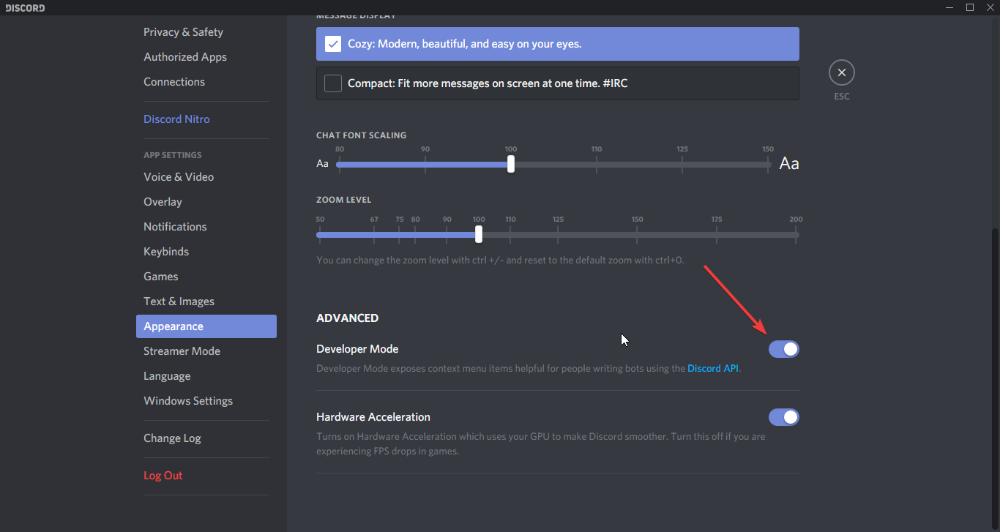

# Basic Concepts / Getting Started

## How do I get started?
First of all, welcome! Before you delve into using the library, however, you should have some decent understanding of the language you are about to use. This library touches on TAP (Task-based Asynchronous Pattern), polymorphism, interface and many more advanced topics extensively. Please make sure that you understand these topics to some extent before proceeding.
  
  Here are some examples:
  1. [Official quick start guide](https://github.com/RogueException/Discord.Net/blob/dev/docs/guides/getting_started/samples/intro/structure.cs)
  2. [Official template](https://github.com/foxbot/DiscordBotBase/tree/csharp/src/DiscordBot)
  
Please note that you should *not* try to blindly copy paste the code. It is meant to be a template or a guide. It is not meant to be something that will work out of the box.
  
## How do I add my bot to my server/guild?

The [OAuth2 URL](https://discordapp.com/developers/tools/oauth2-url-generator) can be generated via the Discord developer page. This allows you to set the permissions that the bot will be added with. With this method, bots will also be assigned their own special roles that normal users cannot use, which is what we call a `Managed` role.

## What is a Client/User/Object ID? Is it the token?

Each user and object on Discord has its own snowflake ID generated based on various conditions, see [here](https://this.is-a-professional-domain.com/7da0e4.png). The ID can be seen by anyone; it is public. It is merely used to identify an object in the Discord ecosystem. Many things in the library require an ID to retrieve the said object. 
  
  There are 2 ways to obtain the said ID. 
  1. Enable Discord's developer mode. With developer mode enabled, you can - as an example - right click on a guild and copy the guild id (please note that this does not apply to Role IDs, see below).
  
  2. Escape the object using `\` in front the object. For example, when you do `\@Example#1234`, it will return the user ID of the aforementioned user.
  
A token is a credential used to log into an account. This information should be kept **private** and for your eyes only. Anyone with your token can log into your account. This applies to both user and bot accounts. That also means that you should never ever hardcode your token or add it into source control, as your identity may be stolen by scrape bots on the internet that scours through constantly to obtain a token.

## How do I get the role ID?

Several common ways to do this:
  1. Make the role mentionable and mention the role, and escape it using the `\` character in front.
  2. Inspect the roles collection within the guild via your debugger.
  
Please note that right-clicking on the role and copying the ID will **not** work. It will only copy the message ID.

## I have more questions! 

Please visit us at #dotnet_discord-net at the Discord API server. Describe the problem in details to us, and preferably with the problematic code uploaded onto [Hastebin](https://hastebin.com).
